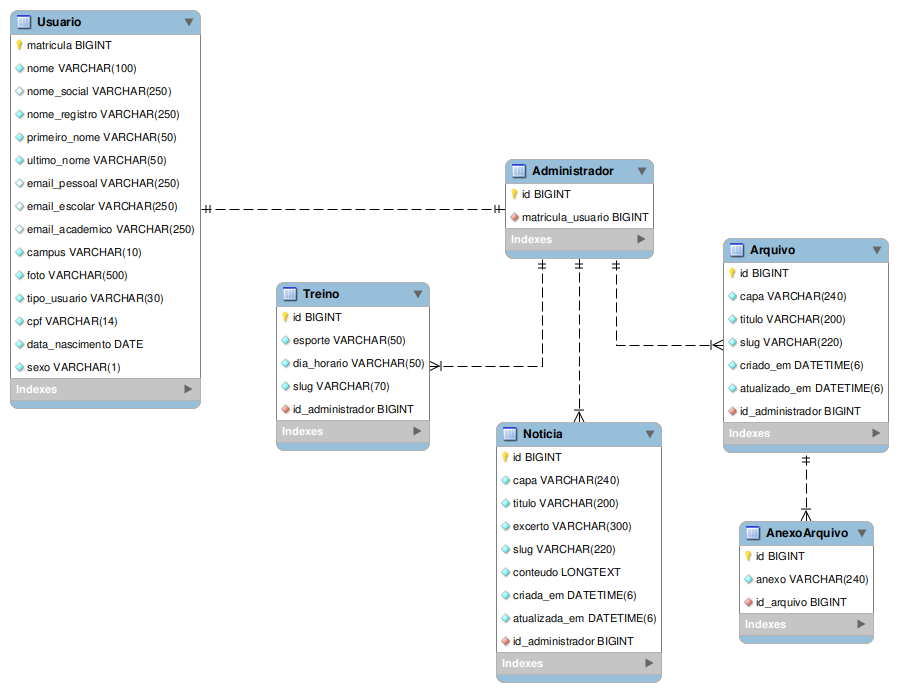

#  Sports Center IFCN 

O presente repositório é utilizado para armazenar o código do Sports Center IFCN. Este projeto está sendo desenvolvido como método de avaliação da disciplina de Projeto Integrador, requerida no 3º período do curso técnico integrado em Informática do IFRN *Campus* Currais Novos.

## Sobre

O Sports Center IFCN é uma plataforma que tem como objetivo principal manter toda a comunidade do IFRN de Currais Novos sempre conectada e atualizada a respeito dos esportes no *campus*, por meio da inserção de diversas funcionalidades no site, como notícias, fotografias, treino, história do *campus* e muito mais.

## Modelagem de Dados

Finalizada a modelagem de dados, foi possível chegar ao diagrama entidade-relacionamento (DER) mostrado na imagem abaixo.



## Execução

> É necessário ter o interpretador [Python](https://www.python.org/downloads/) na versão 3.12.1 instalado no sistema.

Baixe o repositório, abra o terminal na raiz dele, crie um ambiente virtual e o ative.

```bash
python -m venv venv
. venv/bin/activate
```

Em seguida, instale os pacotes necessários, como mostrado na seção de [dependências](#dependências).

> Certifique-se de configurar corretamente o arquivo `.env`.

Feitos esses procedimentos, é só fazer as migrações para a base de dados e coletar os arquivos estáticos.

```bash
. scripts/all.sh
```

Pronto, o projeto já pode ser executado.

```bash
. scripts/runserver.sh
```

## Ferramentas

As ferramentas utilizadas na aplicação são mostradas na seguinte lista.

- Python
- HTML
- CSS
- JavaScript

## Dependências

O projeto possui algumas dependências, as quais estão dispostas na tabela abaixo.

| Pacote                 | Versão              |
|------------------------|---------------------|
| Django                 | >= 4.2.7 e < 4.3    |
| Pillow                 | >= 10.1.0 e < 10.2  |
| mysqlclient            | >= 2.2.0 e < 2.3    |
| social-auth-app-django | >= 5.4.0 e < 5.5    |
| python-dotenv          | >= 1.0.0 e < 1.1    |
| django-summernote      | >= 0.8.20.0 e < 0.9 |

Elas devem ser instaladas utilizando o gerenciador de pacotes do Python, o [PyPI](https://pypi.org/).

### Instalação

Com o ambiente virtual ativado, faça a instalação das dependências do projeto para que ele possa funcionar.

```bash
pip install -r requirements.txt
```

## Equipe

O time do projeto é composto por 7 pessoas, separadas pelos cargos listados abaixo.

| Nome              | Cargo              |
|-------------------|--------------------|
| Valdyson Henrique | Scrum Master       |
| Sérgio Dantas     | Programador Sênior |
| Gabriel Medeiros  | Programador Sênior |
| João Vitor        | Programador Pleno  |
| Maria Gabriela    | Programadora Plena |
| Jordan Cainã      | Programador Júnior |
| Pedro Samuel      | Programador Júnior |
